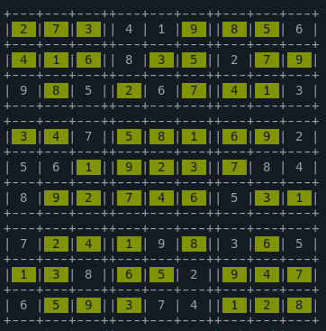
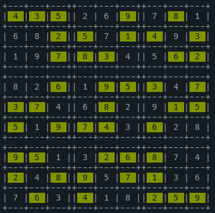
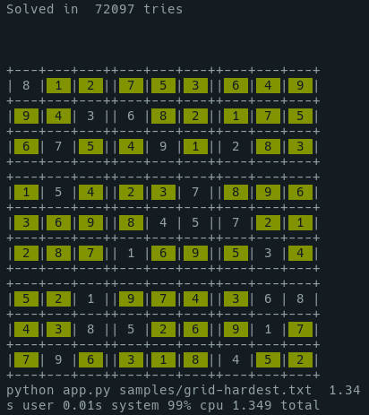

# solver-sudoku

  Backtracking - Sudoku Solver Implementation

This project is an implementation of a sudoku solver.

## Usage

    python app.py samples/grid1.txt

    python app.py samples/grid2-hard.txt 10


### Arguments 

- grid as .txt, with in "empty" cells 0 instead.
- Optional : delay in ms between each display of the grid. (0 = Only result will be display)

```
    000410006
    000800900
    905060003
    007000002
    160000084
    800000300
    700090105
    008002000
    600074000
```


## Examples

Live demo : 

[](https://asciinema.org/a/502207)








### Hardest ever, really ? 

[Seems that a Finnish mathematician claims to have designed the world's most difficult Sudoku.](https://abcnews.go.com/blogs/headlines/2012/06/can-you-solve-the-hardest-ever-sudoku)


